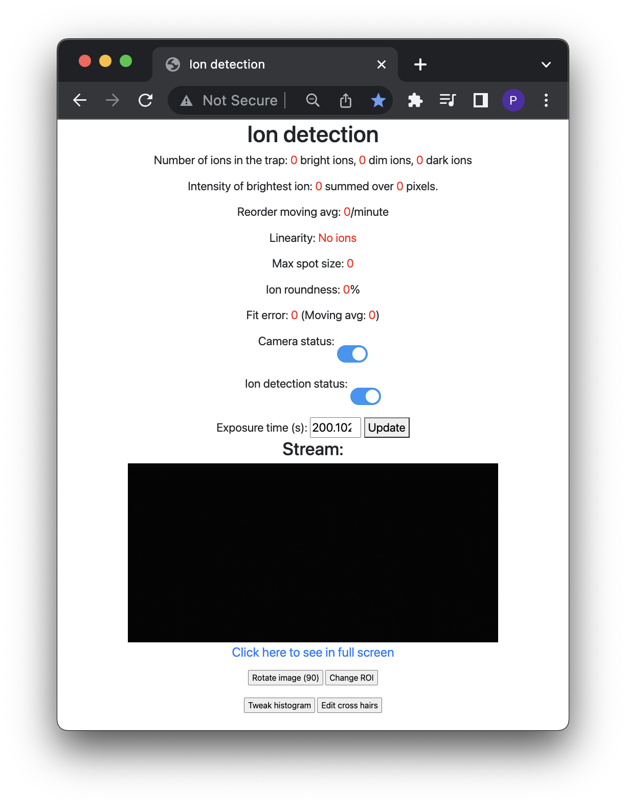

# Hamamatsu Camera

https://www.hamamatsu.com/eu/en/product/cameras/qcmos-cameras.html

## Installation 

```
git clone --recurse-submodules git@gitlab.phys.ethz.ch:tiqi-projects/qchub/devices/hamamatsu-camera.git
cd hamamatsu-camera
poetry install
poetry run python -m src.main
```

## Plugin


